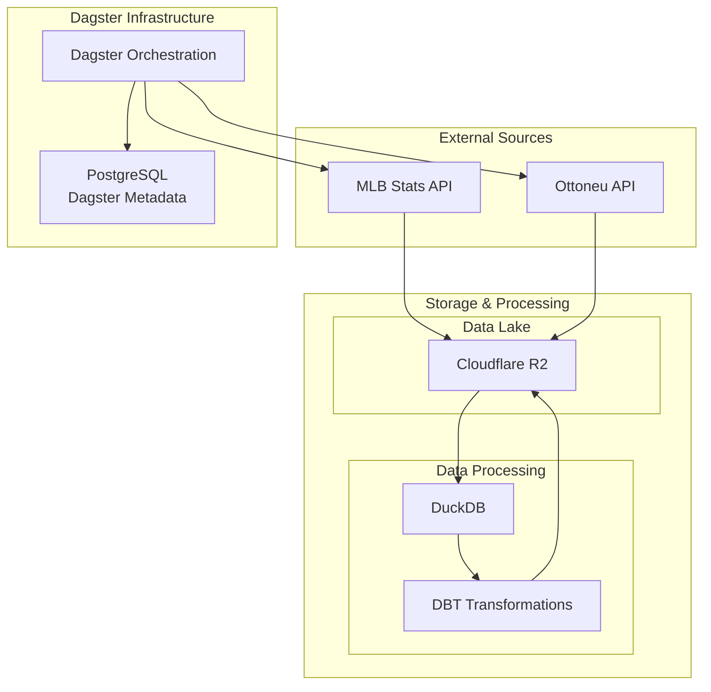
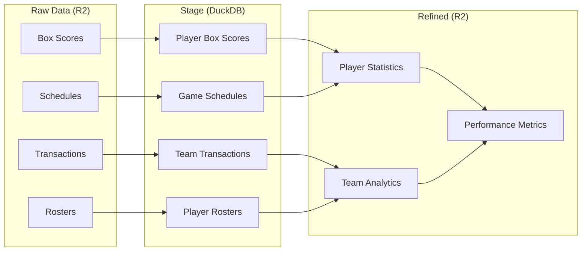
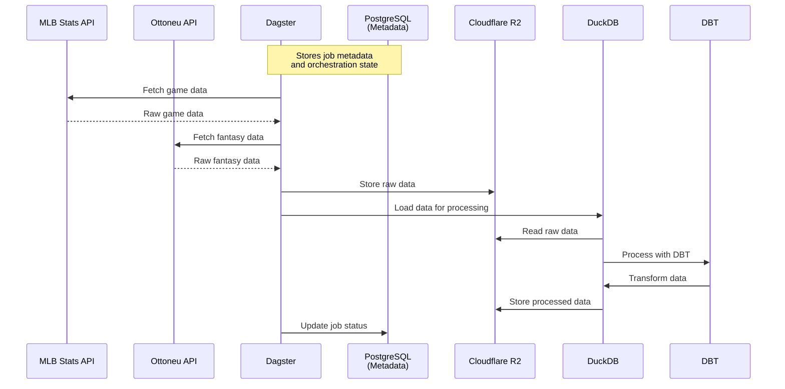

# MLB Stats Dagster Project

<div align="center">
  <a target="_blank" href="https://dagster.io">
    
  </a>
</div>

A comprehensive data pipeline project that processes MLB statistics and Ottoneu fantasy baseball data using Dagster.

## Data Flow Architecture

### High-Level System Architecture


### Asset Lineage


### Data Processing Flow


## Features

- MLB Statistics Processing
  - Fetches data from MLB Stats API
  - Processes box scores and game schedules
  - Historical and real-time data processing
- Ottoneu Fantasy Baseball Integration
  - League transaction tracking
  - Player roster analysis
  - Team performance metrics
- Data Storage & Processing
  - Cloudflare R2 for data lake storage (raw and processed data)
  - DuckDB for efficient data processing and transformations
  - PostgreSQL for Dagster metadata and job orchestration
- DBT Integration
  - Modular data transformations
  - Incremental processing
  - Data quality tests

## Project Structure

```
mlb_stats-dagster/
├── mlb_stats/              # Main Python package
│   ├── assets/            # Dagster assets definitions
│   ├── jobs/             # Dagster job definitions
│   ├── resources/        # Custom resource implementations
│   ├── sensors/          # Event sensors
│   └── io/              # I/O management
├── mlb_stats_dbt/         # DBT transformations
├── env/                   # Environment configuration
│   ├── .env.schema       # Environment variable documentation
│   ├── .env.default      # Default development values
│   └── .env.production   # Production configuration (not in VCS)
├── config/               # Dagster configuration
└── tests/               # Test suite
```

## Prerequisites

- Python 3.10+
- Docker and Docker Compose
- MLB Stats API access (if required)
- Ottoneu API credentials
- Cloudflare R2 account (for data lake)

## Installation

1. Clone the repository:
   ```bash
   git clone https://github.com/yourusername/mlb-stats-dagster.git
   cd mlb-stats-dagster
   ```

2. Set up the environment:
   ```bash
   # Install dependencies
   pip install poetry
   poetry install

   # Set up environment configuration
   cp env/.env.default env/.env
   ```

3. Configure your environment variables in `env/.env`

## Development Setup

### Local Development

1. Start the development environment:
   ```bash
   ENV=development dagster dev
   ```

2. Access the Dagster UI at http://localhost:3000

### Docker Development

1. Build and start the containers:
   ```bash
   docker-compose up --build
   ```

2. Access the Dagster UI at http://localhost:3000

## Environment Configuration

The project uses a flexible environment configuration system:

- `ENV=development` → Uses `.env.default`
- `ENV=production` → Uses `.env.production`
- `ENV=staging` → Uses `.env.staging`

See [Environment Configuration](env/README.md) for detailed setup instructions.

## Running Jobs

### CLI

```bash
# Run a specific job
dagster job execute -f mlb_stats/jobs/mlb_api.py

# Materialize assets
dagster asset materialize --select "*"
```

### Scheduling

Jobs can be scheduled through the Dagster UI or configured in `mlb_stats/schedules.py`.

## Testing

```bash
# Run all tests
pytest

# Run specific test file
pytest mlb_stats_tests/test_assets.py
```

## Deployment

### Docker Production Deployment

1. Build the production image:
   ```bash
   docker build -t mlb-stats-dagster .
   ```

2. Run with production configuration:
   ```bash
   docker run -e ENV=production -p 3000:3000 mlb-stats-dagster
   ```

### Dagster Cloud Deployment

This project is compatible with Dagster Cloud. See the [Dagster Cloud Documentation](https://docs.dagster.cloud) for deployment instructions.

## Contributing

1. Fork the repository
2. Create a feature branch
3. Commit your changes
4. Push to the branch
5. Create a Pull Request

## License

This project is licensed under the MIT License - see the LICENSE file for details.

## Acknowledgments

- [Dagster](https://dagster.io/) for the data orchestration framework
- [MLB Stats API](https://statsapi.mlb.com/) for baseball statistics
- [Ottoneu Fantasy Baseball](https://ottoneu.fangraphs.com/) for fantasy baseball data
